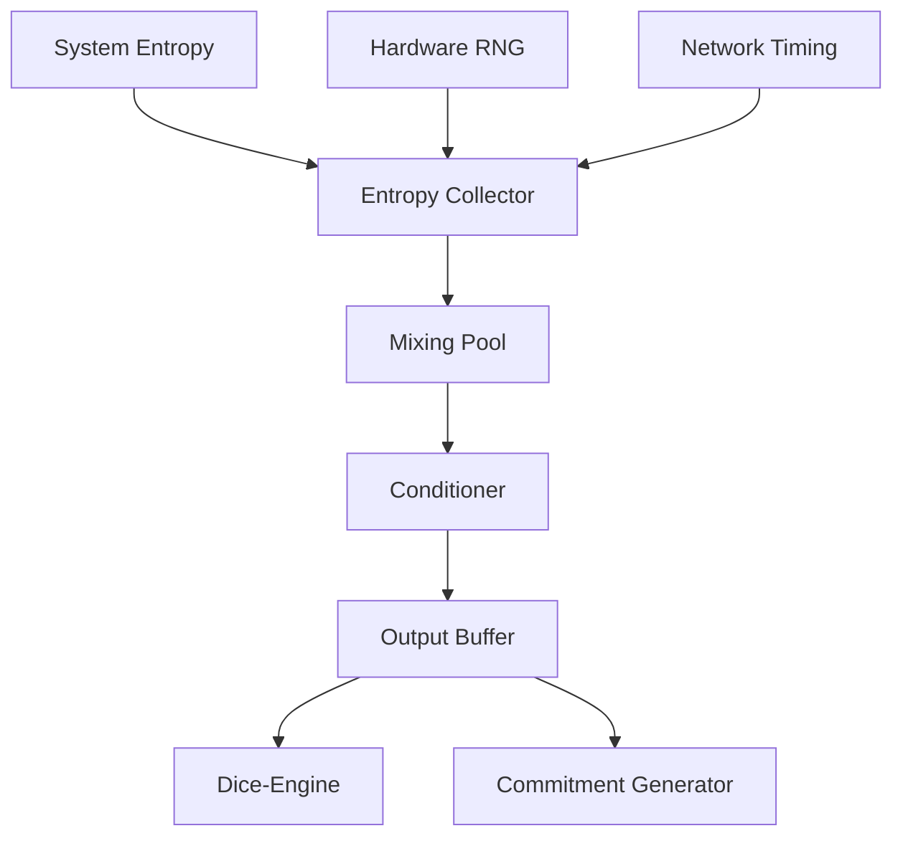

# Entropy-Buffer Architecture

> Agent context artifact for the cryptographic entropy pool manager.

## Purpose

Cryptographically secure entropy pool manager providing the randomness foundation for fair, auditable dice rolls across the platform.

## Technology Stack

- **Language**: Python 3.11+
- **Crypto**: `secrets`, `hashlib`
- **Persistence**: Encrypted pool storage

## Directory Structure

```
├── src/entropy_buffer/
│   ├── pool/           # Entropy pool management
│   ├── sources/        # Entropy collectors
│   ├── mixing/         # Entropy mixing algorithms
│   └── proofs/         # Commitment scheme
├── tests/
└── docs/
```

## Component Graph



## Pool Management

```python
from entropy_buffer import EntropyPool

pool = EntropyPool(capacity=1024)
pool.feed(os.urandom(256))
entropy = pool.extract(32)  # 32 bytes
```

## Security Guarantees

- Forward secrecy: extracted entropy cannot reveal pool state
- Mixing function: cryptographic hash-based
- No predictability: no observable patterns
